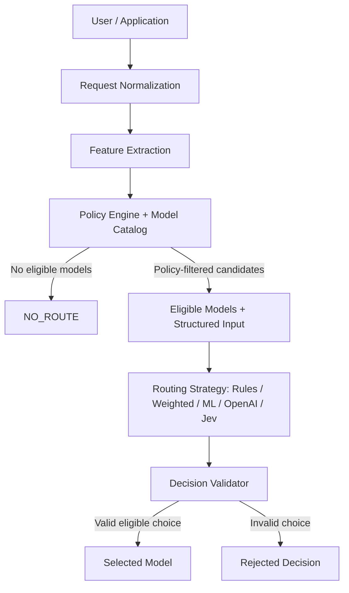

# Smart Model Router for Regulated AI

**Can a fast System 1 decision model route AI workloads as effectively as a general-purpose LLM—while being faster, cheaper, and policy-safe?**

Smart Model Router is an experimental policy-aware routing framework for regulated AI environments.

Instead of sending every request to the same model, it first determines which models are permitted by governance and then compares different ways of choosing among those eligible models.

> **Governance decides what is permitted. Intelligence decides what is preferred.**

Hard policy constraints execute **before** intelligent routing: **Governance → Eligibility → Optimization → Validation**. No routing strategy can override governance.

## Why this research matters

Enterprise AI platforms increasingly have access to many models. In a regulated environment, model routing raises several connected questions:

1. Which models are allowed to handle this request?
2. Among those allowed, which should handle it?
3. Does intelligent routing justify its latency and cost?
4. Is a general-purpose LLM needed to make that decision?
5. Could a smaller, faster decision model perform the routing role?
6. Could simple heuristics or traditional ML be sufficient?

The broader research question is how **rules, weighted heuristics, traditional ML, general-purpose LLMs, and specialized decision models** compare for policy-aware routing in a regulated banking environment.

## Architecture: policy before preference



Deterministic policies enforce configured classification, provider, region, modality, context and other constraints. Strategies choose only among eligible candidates, and validation checks the resulting decision.

**The experiment evaluates the routing decision. It does not execute the selected downstream model.**

## Five routing paradigms

| Paradigm | Router | Execution in the final comparison |
|---|---|---|
| Deterministic rules | Rules | Frozen baseline replay |
| Weighted heuristics | Weighted | Frozen baseline replay |
| Traditional machine learning | Random Forest ML | Frozen baseline replay |
| General-purpose LLM | OpenAI — `gpt-4.1-mini-2025-04-14` | Live, OpenAI direct (`OPENAI_DIRECT`) |
| System 1 decision model | Jev 1.13 | Live, via OpenRouter (`JEV_VIA_OPENROUTER`) |

Local decisions are replayed from the validated frozen baselines. ML is not retrained or reconstructed during the final comparison. OpenAI and Jev were evaluated as live inference-based routing approaches.

## Experiment at a glance

| Experiment | Requests | Design | Successful live routing decisions |
|---|---:|---|---:|
| Primary | 400 | 200 IID + 200 template-held-out; five routers | 608: 304 OpenAI + 304 Jev |
| Stability | 50 routable | 25 per benchmark × five repetitions × two live routers | 500: 250 OpenAI + 250 Jev |
| **Combined live evidence** | | | **1,108** |

The primary sample contains **304 routable requests and 96 policy-handled `NO_ROUTE` outcomes**: IID has 149 routable / 51 `NO_ROUTE`; held-out has 155 / 45. Policy-handled `NO_ROUTE` requests generated **no external routing calls**.

Across both experiments there were **zero API failures, invalid decisions, ineligible selections, or policy violations**.

- **IID_SYNTHETIC:** new synthetic samples from a familiar template family. IID refers to Independent and Identically Distributed.
- **TEMPLATE_HELD_OUT:** requests from templates excluded from ML training and validation, within known task categories.

The synthetic reference objective prefers the cheapest eligible model within **0.12** of the highest configured eligible quality score. These labels derive from configured policy, quality and cost assumptions, not human annotations or measured model responses. See the [methodology](docs/BENCHMARK_METHODOLOGY.md) for the training/validation design.

## Headline results

**Synthetic Reference-Route Agreement — including correct abstentions**, with 200 requests per benchmark:

| Router | IID Preferred | Held-out Preferred | IID Acceptable | Held-out Acceptable | Mean latency — all requests | Mean latency — live routed requests | External routing API cost |
|---|---:|---:|---:|---:|---:|---:|---:|
| Rules | 65.5% | 63.0% | 86.5% | 88.5% | ~0.57–0.58 ms | N/A | $0 |
| Weighted | 78.0% | 76.5% | 84.0% | 85.0% | ~0.57–0.59 ms | N/A | $0 |
| ML | 99.0% | 99.0% | 99.5% | 99.0% | ~1.54–1.62 ms | N/A | $0 |
| OpenAI | 75.5% | 71.5% | 85.0% | 83.5% | ~1.06–1.09 s | **1.424 / 1.406 s** | $0.2230 |
| Jev via OpenRouter | 74.5% | 70.0% | 86.0% | 84.0% | ~0.41–0.44 s | **0.544 / 0.562 s** | $0.0300 |

Latency ranges in the table show benchmark means over all requests, including policy-handled NO_ROUTE cases. For the direct operational comparison between the two live routers, the more relevant measurement is latency on requests that actually generated an external routing decision. Across those routed requests, OpenAI averaged 1423.75 ms (IID) and 1406.17 ms (template-held-out), while Jev via OpenRouter averaged 543.80 ms (IID) and 562.02 ms (template-held-out). This corresponds to approximately 2.62× and 2.50× lower observed mean live-routing latency, respectively, for the Jev-via-OpenRouter execution path.

Rules, Weighted and ML latencies are historical frozen-baseline measurements; OpenAI and Jev latencies were measured during the primary live experiment. These latency observations are specific to the evaluated models, provider paths, configuration and measurement period and should not be interpreted as an inherent performance difference between model architectures.

Sources: [primary summary](reports/final_experiment/20260929T152852-8d825a67/benchmark_summary.csv) · [cost summary](reports/final_experiment/20260929T152852-8d825a67/cost_summary.csv).

## Key findings

1. **ML closely reproduced the synthetic routing objective.** Preferred agreement was 99% on both benchmarks. The ML router was explicitly trained to approximate this synthetic reference-routing function. This demonstrates learning and generalization of that objective, not universal model-selection superiority.

2. **Weighted heuristics were competitive.** Preferred agreement was 78.0% / 76.5% for Weighted, compared with 75.5% / 71.5% for OpenAI and 74.5% / 70.0% for Jev (IID / held-out). Paired exact McNemar tests with Holm correction at α = 0.05 did not establish a significant preferred or acceptable agreement advantage for either live router over Weighted.

3. **No statistically detectable OpenAI–Jev agreement difference was observed.** The paired analysis found no statistically detectable difference in preferred or acceptable Synthetic Reference-Route Agreement between OpenAI and Jev on either benchmark. This result does not establish statistical equivalence or non-inferiority; it means that this experiment did not detect an agreement difference between the two live routing approaches.

4. **The Jev-via-OpenRouter path showed lower observed live-routing latency and routing API cost in this experiment.** For requests that generated an external routing decision, mean latency was 543.80 ms vs. 1423.75 ms on IID requests and 562.02 ms vs. 1406.17 ms on template-held-out requests for Jev via OpenRouter and OpenAI, respectively. This corresponds to approximately 2.62× and 2.50× lower observed mean live-routing latency for the Jev-via-OpenRouter path. Total primary external routing API costs were $0.029983 for Jev via OpenRouter and $0.223006 for OpenAI, an observed difference of approximately 7.44×. These measurements are specific to the frozen models, provider paths, pricing, configuration and measurement period; they do not establish an inherent latency or cost advantage of one model architecture or provider.

5. **Hard governance remained independent of routing intelligence.** Zero policy violations and zero ineligible selections reflect the deterministic eligibility filtering and decision validation that constrain the routers. They are not evidence that ML, OpenAI or Jev independently learned to enforce policy.

See the saved [paired statistical comparisons](reports/final_experiment/20260929T152852-8d825a67/statistical_comparisons.csv).

## Why test a System 1 decision model?

General-purpose LLMs support broad language and reasoning tasks. Routing is a bounded decision problem:

**Structured input + finite candidate set + explicit objectives + hard policy boundaries → one routing decision.**

This raises a research hypothesis: specialized fast decision models may be useful for AI control-plane decisions where full generative reasoning is unnecessary. Jev 1.13 represents that approach in this five-way comparison; it is a research subject, not an assumed winner.

The configured model was **`typesafe/jev-1.13`**, with returned revision **`typesafe/jev-1.13-20260917`**, executed through **`JEV_VIA_OPENROUTER`**. All Jev latency and cost observations are end-to-end **Jev-via-OpenRouter** measurements, not direct Jev API measurements.

## Stability: repeated decisions on identical inputs

| Benchmark | OpenAI full consistency | Jev full consistency | OpenAI pairwise | Jev pairwise |
|---|---:|---:|---:|---:|
| IID | 80% | 96% | 90.4% | 98.4% |
| Template-held-out | 80% | 100% | 90.4% | 100% |

Full consistency is the share of requests receiving the same selection across all five repetitions. Pairwise agreement measures matching selections across repetition pairs.

Across five repeated decisions on identical structured inputs, Jev showed greater observed selection consistency in this 50-request sample. **This comparison is descriptive; it does not establish statistical superiority.** All **500/500** stability decisions succeeded, with **zero retries and zero failures**. Repetitions are not independent benchmark samples.

Source: [stability summary](reports/stability/20260929T155310-839c6b13/stability_summary.csv).

## An important engineering result

> **More sophisticated routing did not monotonically produce better routing outcomes.**

Under this synthetic objective, Rules often found an acceptable route, while Weighted substantially improved preferred-route agreement over Rules and remained statistically competitive with the live routers. ML learned the reference-routing function closely. Live inference introduced external latency and cost, while the specialized decision-model path showed promising observed latency, cost and stability characteristics.

The results support comparing routing methods against the actual objective and operational constraints, rather than assuming that a more sophisticated router will improve decisions.

## Fairness of the comparison

All primary routers used the **same normalized requests, policy-filtered candidate sets and canonical structured information**. Live routers received no synthetic ground truth, preferred reference model, acceptable reference-model list, request ID as a decision feature, or raw prompt. The primary comparison was **`STRUCTURED_ONLY`**.

Frozen baseline replay preserves the original local decisions for those exact requests. Its latency is not a newly executed local measurement alongside the live providers.

## Repository structure

```text
app/                 routing, policy, adapters and decision validation
config/              frozen policies, model catalog and experiment settings
evaluation/          experiment runners, reporting and statistical methods
scripts/             original synthetic generators
tests/               local regression suite
ui/                  Streamlit application
docs/                methodology and research release documentation
data/                synthetic datasets and frozen final sample
reports/
  final_experiment/  primary results, statistics and execution provenance
  stability/         repeated-decision results and execution provenance
```

Explore the [primary reports](reports/final_experiment/20260929T152852-8d825a67/) and [stability reports](reports/stability/20260929T155310-839c6b13/). Detailed integrity checks, included provenance and legacy test-fixture boundaries are documented in [RESEARCH_RELEASE.md](docs/RESEARCH_RELEASE.md).

## Research limitations

- Synthetic Reference-Route Agreement is not downstream response quality; ML was trained against that synthetic objective.
- Held-out testing excludes templates within known task categories, not entire tasks. Request-level bootstrap does not fully model shared template structure.
- The stability sample is small and descriptive; repeated observations are not independent samples.
- Non-significant OpenAI/Jev differences do not prove equivalence.
- Provider latency and cost are specific to the model, configuration, pricing and measurement time. Jev measurements include the OpenRouter execution path.
- Local external API cost of zero does not imply zero total compute cost or TCO.
- No selected downstream model responses were executed or evaluated. These findings do not establish production readiness or real-world model-selection superiority.

See [RESEARCH_RELEASE.md](docs/RESEARCH_RELEASE.md) for complete methodology, provenance and evidence boundaries.

The [final sample manifest](data/final_experiment/final-70db720aadaa0322/sample_manifest.json), [research release document](docs/RESEARCH_RELEASE.md) and [artifact SHA-256 checksums](RESEARCH_ARTIFACT_SHA256SUMS.txt) support independent inspection. Cite the repository together with the frozen tag and its target commit.
