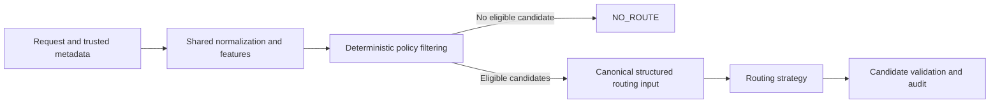

# Smart-Model-Router-for-Regulated-AI
Policy-aware AI routing comparing rules, ML, LLMs, and System 1 decision models like Jev.

## Frozen research release

**Smart Model Router V1 is a completed, frozen research experiment.** The release
tag is **`v1.0.0-research`**. The experimental phase is closed. This repository
preserves the implementation, configuration, synthetic data, routing decisions,
statistical outputs and provenance. It does not evaluate selected downstream
models or their response quality.

Start with [RESEARCH_RELEASE.md](docs/RESEARCH_RELEASE.md) for the research design,
evidence boundaries, integrity checks and exact run identifiers. Historical
development documents describe earlier capabilities and protocols; the release
document identifies the completed V1 evidence and takes precedence for interpreting it.

## Research question

How do deterministic rules, weighted heuristics, traditional machine learning,
general-purpose LLMs, and specialized decision models compare for policy-aware
AI model routing in a regulated banking environment?

**Synthetic Reference-Route Agreement measures agreement with the project's
synthetic routing objective. It does not measure downstream response quality,
production accuracy, or an objectively best model.**

## Architecture and governance boundary



Hard governance determines which models are permitted. Routing strategies choose
only among policy-eligible candidates. Classification, provider/region, modality,
context and other configured constraints are enforced before strategy selection;
weights and model responses cannot override them. A valid abstention is `NO_ROUTE`.

All primary strategies receive equivalent structured information and eligible
candidate sets. Raw prompts, reference labels, preferred/acceptable reference
models and request IDs are not supplied as live routing decision features.

## Routing strategies

| Approach | Implementation | Final experiment execution |
|---|---|---|
| Rules | Deterministic rules | Frozen baseline replay |
| Weighted | Weighted heuristic | Frozen baseline replay |
| ML | Random Forest | Frozen baseline replay |
| OpenAI | `gpt-4.1-mini-2025-04-14` | Live, OpenAI direct |
| Jev | `typesafe/jev-1.13` | Live, via OpenRouter |

The ML router was trained to approximate the synthetic reference-routing
function. The final experiment replays its recorded decisions; it does not
retrain or reconstruct the fitted model. Replayed latency remains a historical
baseline measurement. FrontierOnly, CheapestOnly and mock adapters remain in the
source for compatibility but are not additional live final-experiment strategies.

## Experimental methodology

- **IID_SYNTHETIC:** new synthetic samples from a familiar template family.
- **TEMPLATE_HELD_OUT:** templates excluded from ML training and validation,
  within already represented task categories. This is not task-held-out testing.
- ML provenance records 600 generated training requests (seed 1042), 464 fitted
  and 136 excluded, with 200 validation requests (seed 1043). Forest settings
  were fixed before final testing. Original source test seeds are 42 and 2042.
- The final sample uses the frozen hierarchical-largest-remainder protocol,
  seed 4042, after excluding 15 prior-pilot requests per benchmark. Stability
  uses 25 routable members of each primary subset, seed 5042, for five repetitions.
- Reference labels use configured synthetic quality, costs and policy: the
  preferred model is the cheapest eligible model within 0.12 of the best eligible
  configured quality score. Labels are not human annotations or measured quality.
- Statistical methods and outputs are frozen. Repeated stability observations
  are clustered within requests and are not independent benchmark samples.

See [benchmark methodology](docs/BENCHMARK_METHODOLOGY.md) and
[final experiment protocol](docs/FINAL_EXPERIMENT.md). Do not regenerate data,
labels, samples or analysis outputs in this release checkout.

## Primary experiment

Run: **`20260929T152852-8d825a67`**.

| Benchmark | Requests | Routable | NO_ROUTE |
|---|---:|---:|---:|
| IID_SYNTHETIC | 200 | 149 | 51 |
| TEMPLATE_HELD_OUT | 200 | 155 | 45 |
| Total | 400 | 304 | 96 |

OpenAI and Jev each made 304 successful live routing decisions: **608 total**,
with zero failures, retries, invalid decisions, ineligible selections or policy
violations. Policy-handled `NO_ROUTE` cases incurred no external routing call.

[Primary reports](reports/final_experiment/20260929T152852-8d825a67/) include
request-level results, confidence intervals, statistical comparisons, latency,
cost, generalization differences, manifests and the attempt journal.

## Stability experiment

Run: **`20260929T155310-839c6b13`**.

**50 routable requests × five repetitions × two live routers = 500 calls.**
Each provider made 250 successful decisions. Failures, retries, timeouts, rate
limits, invalid decisions, ineligible selections and policy violations were all
zero. Rules, Weighted and ML were not repeated in this experiment.

[Stability reports](reports/stability/20260929T155310-839c6b13/) contain
selection consistency, per-repetition Synthetic Reference-Route Agreement,
latency/cost summaries, request-level observations and integrity records.
The two experiments contain **1,108 successful live routing decisions** in total.

## Results and source layout

```text
app/                 routing, policy, structured inputs, adapters and audit services
config/              frozen methodology, model catalog, policy and pricing settings
evaluation/          original experiment runners, reporting and statistical code
scripts/             original generators retained for implementation transparency
tests/               original offline regression suite
ui/                  original Streamlit application
docs/                release document and historical methodology documentation
data/                synthetic inputs and the exact final sample
reports/             final evidence and explicitly required provenance/fixtures
```

Final sample:
[`data/final_experiment/final-70db720aadaa0322/sample_manifest.json`](data/final_experiment/final-70db720aadaa0322/sample_manifest.json).

Its semantic content hash is:

```text
70db720aadaa0322b2a9f29b9e9a796269d44d780c7d6c7023c11914eee7f7c0
```

`RESEARCH_ARTIFACT_SHA256SUMS.txt` separately records the byte-level SHA-256 of
every included data/evidence file, including provenance and approved test fixtures.
The semantic sample hash and the JSON file's byte hash have different purposes.

## Reproduction and inspection without AI API calls

Use the frozen tag in a separate checkout. The recorded experiment environment
used Python 3.13.13; `requirements-lock.txt` preserves its package versions.

```bash
git clone https://github.com/debabratapruseth/Smart-Model-Router-for-Regulated-AI.git
cd Smart-Model-Router-for-Regulated-AI
git checkout --detach v1.0.0-research
python3.13 -m venv .venv
source .venv/bin/activate
python -m pip install -r requirements-lock.txt
shasum -a 256 -c RESEARCH_ARTIFACT_SHA256SUMS.txt
```

Package installation contacts package registries, not AI inference providers.
Reading the saved results needs no credentials and does not rerun an experiment:

```bash
python - <<'PY'
import pandas as pd
from pathlib import Path
paths = [
    Path('reports/final_experiment/20260929T152852-8d825a67/benchmark_summary.csv'),
    Path('reports/stability/20260929T155310-839c6b13/stability_summary.csv'),
]
for path in paths:
    print(path)
    print(pd.read_csv(path).to_string(index=False))
PY
```

Run the existing local tests with network connections blocked. Tests use temporary
synthetic fixtures and mocked transports; they must not overwrite frozen evidence:

```bash
python -B - <<'PY'
import os, socket, pytest
for name in ('OPENAI_API_KEY', 'OPENROUTER_API_KEY', 'TYPESAFE_API_KEY'):
    os.environ.pop(name, None)
def deny_network(*args, **kwargs):
    raise RuntimeError('External network access is disabled for offline tests')
socket.socket.connect = deny_network
socket.socket.connect_ex = deny_network
socket.create_connection = deny_network
raise SystemExit(pytest.main(['-q', '-p', 'no:cacheprovider']))
PY
shasum -a 256 -c RESEARCH_ARTIFACT_SHA256SUMS.txt
```

The three files under `reports/trained_ml/` are historical compatibility-test
fixtures only, explicitly approved for inclusion. Their results are not V1 final
findings. Older standalone analysis commands may expect intentionally omitted
exploratory reports; inspect the explicit final/stability paths above instead.

## Live reproduction boundary

No live reproduction is needed to inspect this release. A future, separately
authorized experiment requires valid provider credentials, enabled provider flags,
and **`--allow-live-api`**. Credentials alone never authorize execution. Existing
protocol documentation shows explicitly opted-in commands and attempt caps.
Do not run them as part of preservation, verification or publication of V1.

`.env.example` contains empty credential placeholders and disables live routers
and downstream execution. Do not commit a populated `.env`.

## Limitations

Synthetic Reference-Route Agreement is conditional on the configured routing
objective; ML was trained against that objective. Template-held-out results do
not establish task-held-out or production generalization. Request bootstrap does
not fully model shared template structure. Stability repetitions are not independent
samples, and the stability comparison is descriptive. Non-significant OpenAI/Jev
differences do not establish equivalence.

Provider/model/pricing observations are configuration- and time-specific. Jev
latency and cost measure **Jev via OpenRouter end-to-end**, not direct Jev API
performance. Zero external API cost for local replay does not imply zero compute
cost or total cost of ownership. No selected downstream model was executed or
evaluated for response quality. Original absolute provenance paths are preserved
as historical metadata; use repository-relative paths for inspection.

## Citing this release

Cite this repository together with the annotated tag **`v1.0.0-research`** and its
target commit SHA. Resolve the exact commit with:

```bash
git rev-parse 'v1.0.0-research^{commit}'
```
